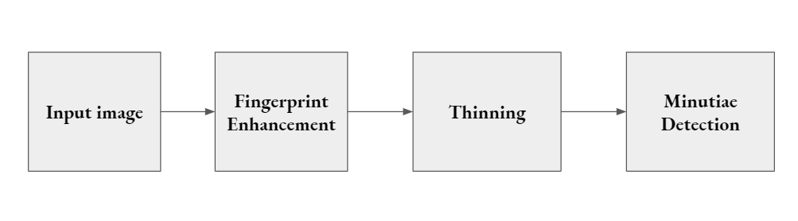
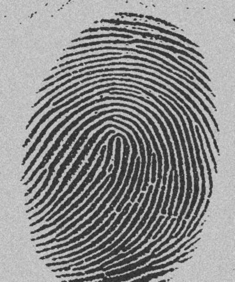
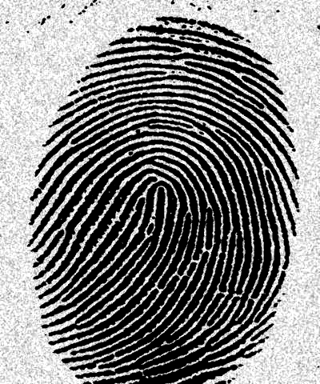
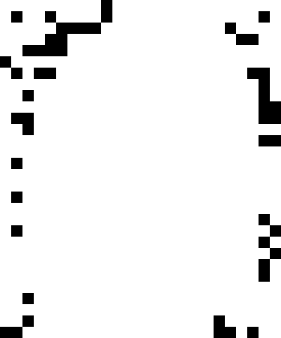
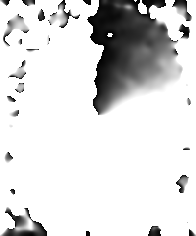
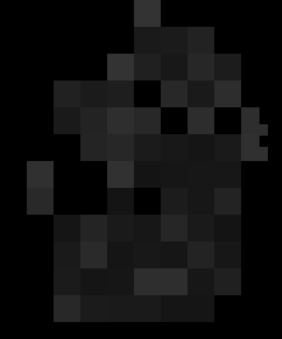
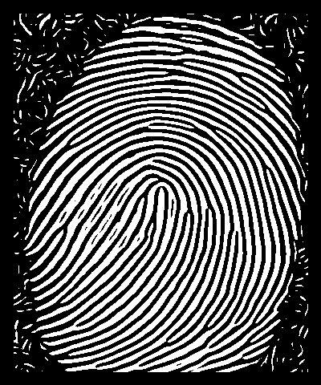
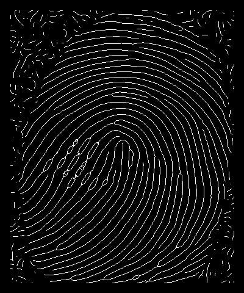
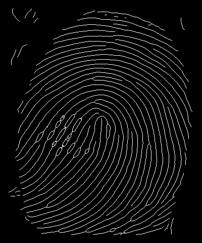

Online-finger-verification
-------
### Description
This code implements paper [On-Line Fingerprint Verification](https://ieeexplore.ieee.org/stamp/stamp.jsp?arnumber=587996) to match given fingerprint images.
At a high level, this paper uses various image processing techniques like Gaussian blurring, thinning to achieve the following two goals
1. Minutia extraction
2. Minutia matching

### Theory
1. Minutia extraction/detection is achieved as 
   - For image enhancement and thinning, we implemented the algorithm proposed in [2].
   - For minutiae detection, we used algorithm proposed in [1]
2. For matching we used Brute force matcher on descriptors obtained at each minutiae.
###Running the code, Input/Output structure
*main.py* is the entry point for the code. This file takes input path for two images and outputs fingerprint matched or not.
*test_input* directory contains test images.
*Images* directory contains images for the document.
### Result

### Intermediate results for the Image Enhancement

Given the test image:

**normalization.py**: 

norm() -  returns the normalized image

ridge_segmentation() - Returns the  segmented ridge region image

**ridge_orientation.py**

ridge_orientation() - Estimates the local orientation of ridges in a fingerprint

**ridge_frequency.py**

ridge_frequency() - Estimates the fingerprint ridge frequency across a fingerprint image

**ridge_filter.py** 

ridge_filter - Enhances fingerprint image via oriented filters

**image_enhancement.py**

enhance_image() - Uses above functions to enhance the fingerprint image

skeletonize() - Uses morphological operation skeletonization on the enhanced image

remove_noise - Removes the outlier noise around the skeletonized image

Given the test image:

**normalization.py**: 

norm() -  returns the normalized image

ridge_segmentation() - Returns the  segmented ridge region image

**ridge_orientation.py**

ridge_orientation() - Estimates the local orientation of ridges in a fingerprint

**ridge_frequency.py**

ridge_frequency() - Estimates the fingerprint ridge frequency across a fingerprint image

**ridge_filter.py** 

ridge_filter - Enhances fingerprint image via oriented filters

**image_enhancement.py**

enhance_image() - Uses above functions to enhance the fingerprint image

skeletonize() - Uses morphological operation skeletonization on the enhanced image

remove_noise() - Removes the outlier noise around the skeletonized image

**ridge.py, plot_util.py and minutiae_util.py** 

The above .py files help in plotting the orientations of the minutiae points in the fingerprint image

### References
[1] [On-Line Fingerprint Verification](https://ieeexplore.ieee.org/stamp/stamp.jsp?arnumber=587996)   
[2] [Fingerprint Image Enhancement: Algorithm and Performance Evaluation](https://pdfs.semanticscholar.org/bd6d/e6c7fba04a67d30a4bd1261665e6f4745ea8.pdf)
